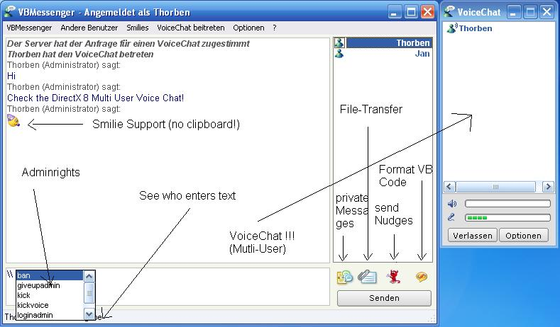

## MultiUser Chat with DirectX8\-VoiceChat, Filetransfer, \(\.\.\.\) \[german\]

### Description

This is a multiUser-Chat with Voice, Filetransfer, private Messages, Nudges, Vb-Function, send little Pictures, fonts, Adminrights....

It's in german. If there is enough interest i will TRANSLATE it.

Have fun!
 
### More Info
 

             |
---                |---
**Submitted On**   |2005-07-31 17:19:16
**By**             |[not\_given](https://github.com/Planet-Source-Code/PSCIndex/blob/master/ByAuthor/not-given.md)
**Level**          |Advanced
**User Rating**    |4.8 (53 globes from 11 users)
**Compatibility**  |VB 6\.0
**Category**       |[Internet/ HTML](https://github.com/Planet-Source-Code/PSCIndex/blob/master/ByCategory/internet-html__1-34.md)
**World**          |[Visual Basic](https://github.com/Planet-Source-Code/PSCIndex/blob/master/ByWorld/visual-basic.md)
**Archive File**   |[MultiUser\_191966812005\.zip](https://github.com/Planet-Source-Code/not-given-multiuser-chat-with-directx8-voicechat-filetransfer-german__1-62012/archive/master.zip)

